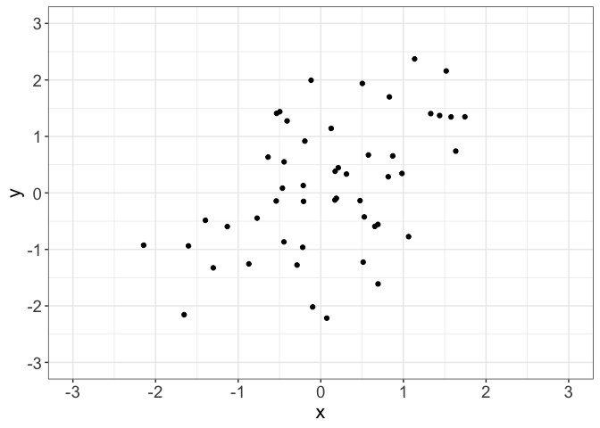
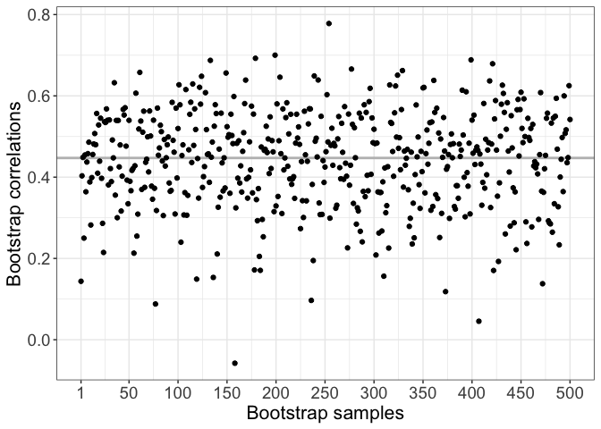
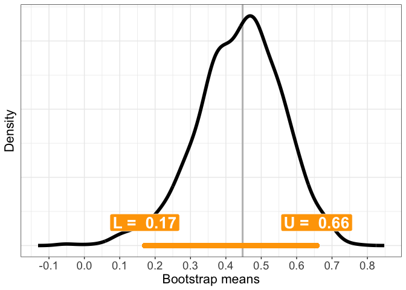
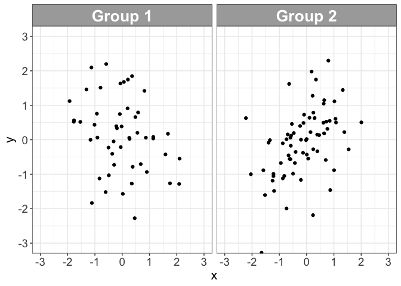
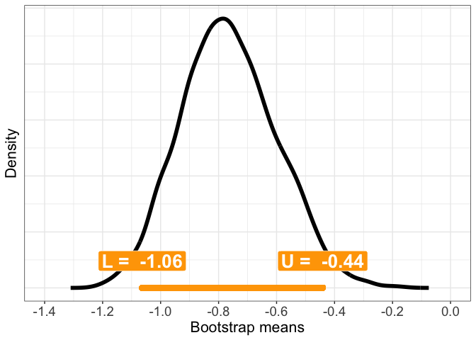
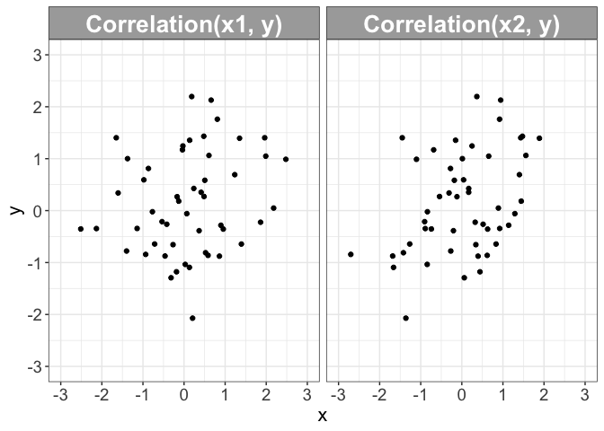
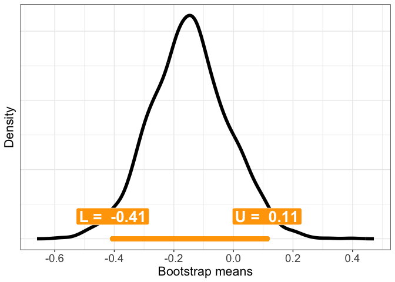
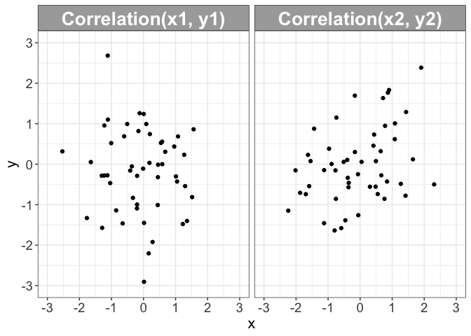
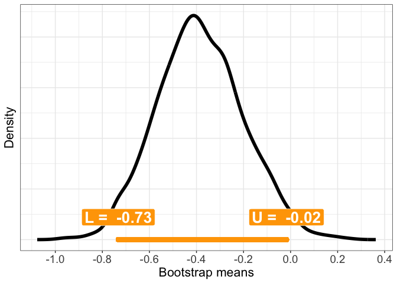

<!-- README.md is generated from README.Rmd. Please edit that file -->

# bootcorci

<!-- badges: start -->

<!-- badges: end -->

The goal of `bootcorci` is to provide bootstrap methods to compute
confidence intervals for correlation coefficients and their differences.
All the functions have been adapted from Rand Wilcox’s
[functions](http://dornsife.usc.edu/labs/rwilcox/software/). The
functions in the package have been standardised in their names, inputs
and outputs. When two versions of the same function existed to handle
separately Pearson’s correlation and robust correlations, the two
versions have been merged. Simplified versions of the correlation
functions have been created to speed up the bootstrap analyses. All the
bootstrap functions have a new option to return the bootstrap samples
(see example below).

Not implemented yet:  
\- methods to compare dependent Pearson correlations;  
\- skipped
correlations.

## Functions

### Correlation functions

| name            | purpose                     | syntax                                        |
| --------------- | --------------------------- | --------------------------------------------- |
| `pearson.test`  | Pearson correlation         | `x, y, alternative = "two.sided"`             |
| `spearman.test` | Spearman correlation        | `x, y, alternative = "two.sided"`             |
| `pbcor.test`    | Percentage bend correlation | `x, y, beta = 0.2, alternative = "two.sided"` |
| `wincor.test`   | Winsorized correlation      | `x, y, tr = 0.2, alternative = "two.sided"`   |

Simplified version are called by the bootstrap functions: `pearson`,
`spearman`, `pbcor`, `wincor`.

### Bootstrap functions

CI = Percentile bootstrap confidence
interval.

| name           | purpose                                                                  | syntax                                                                                                                          |
| -------------- | ------------------------------------------------------------------------ | ------------------------------------------------------------------------------------------------------------------------------- |
| `corci`        | CI for a correlation                                                     | `x, y, method = "pbcor", nboot = 2000, alpha = 0.05, alternative = "two.sided", null.value = 0, saveboot = TRUE, ...`           |
| `twocorci`     | CI for the difference between two independent correlations               | `x1, y1, x2, y2, method = "pbcor", nboot = 2000, alpha = 0.05, alternative = "two.sided", null.value = 0, saveboot = TRUE, ...` |
| `twocorci.ov`  | CI for the difference between two overlapping dependent correlations     | `x1, x2, y, method = "pbcor", nboot = 2000, alpha = 0.05, alternative = "two.sided", null.value = 0, saveboot = TRUE, ...`      |
| `twocorci.nov` | CI for the difference between two non-overlapping dependent correlations | `x1, y1, x2, y2, method = "pbcor", nboot = 2000, alpha = 0.05, alternative = "two.sided", null.value = 0, saveboot = TRUE, ...` |

Functions `corci` and `twocorci` can be applied to Pearson correlation
and to robust regressions. The other functions can only be applied to
robust
regressions.

### Utilities

| name      | purpose                                             | syntax                                                                               |
| --------- | --------------------------------------------------- | ------------------------------------------------------------------------------------ |
| `mkcord`  | Make standard normal correlated data (2 conditions) | `rho=0, n=50`                                                                        |
| `mkcord3` | Make standard normal correlated data (3 conditions) | `rho.x1y=0, rho.x2y=0.5, rho.x1x2=0.2, n=50`                                         |
| `mkcord4` | Make standard normal correlated data (4 conditions) | `rho.x1y1=0, rho.x2y2=0.5, rho.x1x2=0.2, rho.y1y2=0.2, rho.x1y2=0, rho.x2y1=0, n=50` |

## Installation

You can install `bootcorci` from GitHub by using `devtools`:

``` r
install.packages("devtools")
devtools::install_github("GRousselet/bootcorci")
```

## Examples

### 1 correlation

Let’s generate a correlated sample:

``` r
# library(bootcorci)
set.seed(21) # reproducible example
d <- mkcord(rho=0.4, n=50)
```

Note that we set Pearson population correlation using the `rho`
argument. The population value will be different for other correlations,
such as the Spearman, percentage bend and winsorised correlations
available in `bootcorci`. See details
[here](https://psychometroscar.com/2018/09/04/the-spearman-correlation-doesnt-need-to-tell-you-anything-about-the-pearson-correlation/).
This means that if we use the percentage bend sample correlation to
estimate the association between variables, we make inferences about the
percentage bend population correlation.

Illustration:

``` r
# library(ggplot2)
df <- as_tibble(d)
ggplot(data=df, aes(x=x, y=y)) + theme_bw() +
  geom_point() +
  theme(axis.text = element_text(size = 14),
        axis.title = element_text(size = 16)) +
  coord_cartesian(xlim = c(-3, 3), ylim = c(-3, 3)) +
  scale_x_continuous(breaks = seq(-3, 3, 1)) +
  scale_y_continuous(breaks = seq(-3, 3, 1))
```



Estimation + bootstrap confidence interval:

``` r
res <- corci(d$x, d$y, method = "spearman")
```

The default outputs are:  
\- res\(estimate = sample correlation - res\)conf.int = confidence
interval  
\- res\(p.value = p value - res\)bootsamples = bootstrap samples (can be
suppressed by setting `saveboot=FALSE`)  
The `method` argument can be: - “spearman” = Spearman correlation  
\- “pearson” = Pearson correlation  
\- “pbcor” = Percentage bend correlation  
\- “wincor” = Winsorised correlation

The sample Spearman correlation is 0.45, with a 95% percentile bootstrap
confidence interval of \[0.17, 0.66\] and a *p* value of 0.003.

Illustrate bootstrap correlations in the order they were sampled:

``` r
n.show <- 500 # show only n.show first bootstrap correlations
df <- tibble(x = 1:n.show, y = res$bootsamples[1:n.show])
ggplot(df, aes(x = x, y = y)) + theme_bw() +
  geom_hline(yintercept = res$estimate, colour = "grey", size = 1) +
  # comment next line to make a scatterplot instead of a lollipop chart:
  geom_point() + 
  scale_x_continuous(breaks = c(1, seq(50, 500, 50))) +
  theme(axis.text = element_text(size = 14),
        axis.title = element_text(size = 16)) +
  labs(x = "Bootstrap samples", y = "Bootstrap correlations")
```



The sample correlation is marked by a horizontal grey line.

Illustrate bootstrap samples using a density plot:

``` r
df <- as_tibble(with(density(res$bootsamples),data.frame(x,y)))
ci <- res$conf.int

ggplot(df, aes(x = x, y = y)) + theme_bw() +
  geom_vline(xintercept = res$estimate, colour = "grey", size = 1) +
  geom_line(size = 2) +
  scale_x_continuous(breaks = seq(-1, 1, 0.1)) +
  theme(axis.text = element_text(size = 14),
        axis.title = element_text(size = 16),
        axis.text.y = element_blank(),
        axis.ticks.y = element_blank()) +
  labs(x = "Bootstrap means", y = "Density") +
    # confidence interval ----------------------
  geom_segment(x = ci[1], xend = ci[2],
               y = 0, yend = 0,
               lineend = "round", size = 3, colour = "orange") +
  annotate(geom = "label", x = ci[1], y = 0.1*max(df$y), size = 7,
             colour = "white", fill = "orange", fontface = "bold",
             label = paste("L = ", round(ci[1], digits = 2))) +
  annotate(geom = "label", x = ci[2], y = 0.1*max(df$y), size = 7,
             colour = "white", fill = "orange", fontface = "bold",
             label = paste("U = ", round(ci[2], digits = 2)))
```

 The
horizontal line marks the 95% confidence interval. The boxes report the
values of the CI bounds. L stands for lower bound, U for upper bound.

### 2 independent correlations

Generate data:

``` r
set.seed(21) # reproducible example
n1 <- 50
n2 <- 70
d1 <- mkcord(rho=0, n = n1)
d2 <- mkcord(rho=0.4, n = n2)
```

Illustrate data:

``` r
df <- tibble(x = c(d1$x, d2$x),
             y = c(d1$y, d2$y),
             Group = factor(c(rep("Group 1", n1), rep("Group 2", n2)))
             )
ggplot(data=df, aes(x=x, y=y)) + theme_bw() +
  geom_point() +
  theme(axis.text = element_text(size = 14),
        axis.title = element_text(size = 16),
        strip.text.x = element_text(size = 20, colour="white", face="bold"),
        strip.background = element_rect(fill="darkgrey")) +
  coord_cartesian(xlim = c(-3, 3), ylim = c(-3, 3)) +
  scale_x_continuous(breaks = seq(-3, 3, 1)) +
  scale_y_continuous(breaks = seq(-3, 3, 1)) +
  facet_wrap(facets = vars(Group), ncol = 2)
```



Estimation + bootstrap confidence intervals:

``` r
res1 <- corci(d1$x, d1$y, method = "pbcor", saveboot = FALSE)
res2 <- corci(d2$x, d2$y, method = "pbcor", saveboot = FALSE)
res <- twocorci(d1$x, d1$y, d2$x, d2$y, method = "pbcor")
```

For group 1, the sample percentage bend correlation is -0.25 \[-0.49,
0.02\]; for group 2 it is 0.52 \[0.3, 0.69\]. The group difference is
-0.77 \[-1.06, -0.44\]. Given the data and our bootstrap sampling, the
confidence interval is compatible with a range of large population
percentage bend correlation differences.

Illustrate bootstrap differences using a density plot:

``` r
df <- as_tibble(with(density(res$bootsamples),data.frame(x,y)))
ci <- res$conf.int

ggplot(df, aes(x = x, y = y)) + theme_bw() +
  geom_vline(xintercept = res$estimate, colour = "grey", size = 1) +
  geom_line(size = 2) +
  scale_x_continuous(breaks = seq(-2, 2, 0.2)) +
  coord_cartesian(xlim = c(-1.4, 0)) + 
  theme(axis.text = element_text(size = 14),
        axis.title = element_text(size = 16),
        axis.text.y = element_blank(),
        axis.ticks.y = element_blank()) +
  labs(x = "Bootstrap means", y = "Density") +
    # confidence interval ----------------------
  geom_segment(x = ci[1], xend = ci[2],
               y = 0, yend = 0,
               lineend = "round", size = 3, colour = "orange") +
  annotate(geom = "label", x = ci[1], y = 0.1*max(df$y), size = 7,
             colour = "white", fill = "orange", fontface = "bold",
             label = paste("L = ", round(ci[1], digits = 2))) +
  annotate(geom = "label", x = ci[2], y = 0.1*max(df$y), size = 7,
             colour = "white", fill = "orange", fontface = "bold",
             label = paste("U = ", round(ci[2], digits = 2)))
```



### 2 dependent correlations: overlapping case

Here we deal with 3 dependent measurements. We correlate x1 with y and
x2 with y and compare the two correlations.

Generate data:

``` r
set.seed(21) # reproducible example
n <- 50
d <- mkcord3(rho.x1y=0, rho.x2y=0.4, rho.x1x2=0.2, n = n)
```

Illustrate data:

``` r
df <- tibble(x = c(d$x1, d$x2),
             y = c(d$y, d$y),
             Group = factor(c(rep("Correlation(x1, y)", n), rep("Correlation(x2, y)", n)))
             )
ggplot(data=df, aes(x=x, y=y)) + theme_bw() +
  geom_point() +
  theme(axis.text = element_text(size = 14),
        axis.title = element_text(size = 16),
        strip.text.x = element_text(size = 20, colour="white", face="bold"),
        strip.background = element_rect(fill="darkgrey")) +
  coord_cartesian(xlim = c(-3, 3), ylim = c(-3, 3)) +
  scale_x_continuous(breaks = seq(-3, 3, 1)) +
  scale_y_continuous(breaks = seq(-3, 3, 1)) +
  facet_wrap(facets = vars(Group), ncol = 2)
```



Estimation + bootstrap confidence intervals:

``` r
res1 <- corci(d$x1, d$y, method = "pbcor", saveboot = FALSE)
res2 <- corci(d$x2, d$y, method = "pbcor", saveboot = FALSE)
res <- twocorci.ov(d$x1, d$x2, d$y, method = "pbcor")
```

For group 1, the sample percentage bend correlation is 0.2 \[-0.05,
0.44\]; for group 2 it is 0.36 \[0.06, 0.6\]. The group difference is
-0.15 \[-0.41, 0.11\]. Given the data and our bootstrap sampling, the
confidence interval is compatible with a range of large population
percentage bend correlation differences.

Illustrate bootstrap differences using a density plot:

``` r
df <- as_tibble(with(density(res$bootsamples),data.frame(x,y)))
ci <- res$conf.int

ggplot(df, aes(x = x, y = y)) + theme_bw() +
  geom_vline(xintercept = res$estimate, colour = "grey", size = 1) +
  geom_line(size = 2) +
  scale_x_continuous(breaks = seq(-2, 2, 0.2)) +
  # coord_cartesian(xlim = c(-1.4, 0)) + 
  theme(axis.text = element_text(size = 14),
        axis.title = element_text(size = 16),
        axis.text.y = element_blank(),
        axis.ticks.y = element_blank()) +
  labs(x = "Bootstrap means", y = "Density") +
    # confidence interval ----------------------
  geom_segment(x = ci[1], xend = ci[2],
               y = 0, yend = 0,
               lineend = "round", size = 3, colour = "orange") +
  annotate(geom = "label", x = ci[1], y = 0.1*max(df$y), size = 7,
             colour = "white", fill = "orange", fontface = "bold",
             label = paste("L = ", round(ci[1], digits = 2))) +
  annotate(geom = "label", x = ci[2], y = 0.1*max(df$y), size = 7,
             colour = "white", fill = "orange", fontface = "bold",
             label = paste("U = ", round(ci[2], digits = 2)))
```



### 2 dependent correlations: non-overlapping case

Here we deal with 4 dependent measurements. We correlate x1 with y1 and
x2 with y2 and compare the two correlations.

Generate data:

``` r
set.seed(21) # reproducible example
n <- 50
d <- mkcord4(rho.x1y1=0, rho.x2y2=0.4, 
             rho.x1x2=0.1, rho.y1y2=0.1,
             rho.x1y2=0.1, rho.x2y1=0.1, n = n)
```

Illustrate data:

``` r
df <- tibble(x = c(d$x1, d$x2),
             y = c(d$y1, d$y2),
             Group = factor(c(rep("Correlation(x1, y1)", n), rep("Correlation(x2, y2)", n)))
             )
ggplot(data=df, aes(x=x, y=y)) + theme_bw() +
  geom_point() +
  theme(axis.text = element_text(size = 14),
        axis.title = element_text(size = 16),
        strip.text.x = element_text(size = 20, colour="white", face="bold"),
        strip.background = element_rect(fill="darkgrey")) +
  coord_cartesian(xlim = c(-3, 3), ylim = c(-3, 3)) +
  scale_x_continuous(breaks = seq(-3, 3, 1)) +
  scale_y_continuous(breaks = seq(-3, 3, 1)) +
  facet_wrap(facets = vars(Group), ncol = 2)
```



Estimation + bootstrap confidence intervals:

``` r
res1 <- corci(d$x1, d$y1, method = "pbcor", saveboot = FALSE)
res2 <- corci(d$x2, d$y2, method = "pbcor", saveboot = FALSE)
res <- twocorci.nov(d$x1, d$y1, d$x2, d$y2, method = "pbcor")
```

For group 1, the sample percentage bend correlation is -0.06 \[-0.32,
0.22\]; for group 2 it is 0.33 \[0.07, 0.56\]. The group difference is
-0.38 \[-0.73, -0.02\]. Given the data and our bootstrap sampling, the
confidence interval is compatible with a range of large population
percentage bend correlation differences.

Illustrate bootstrap differences using a density plot:

``` r
df <- as_tibble(with(density(res$bootsamples),data.frame(x,y)))
ci <- res$conf.int

ggplot(df, aes(x = x, y = y)) + theme_bw() +
  geom_vline(xintercept = res$estimate, colour = "grey", size = 1) +
  geom_line(size = 2) +
  scale_x_continuous(breaks = seq(-2, 2, 0.2)) +
  # coord_cartesian(xlim = c(-1.4, 0)) + 
  theme(axis.text = element_text(size = 14),
        axis.title = element_text(size = 16),
        axis.text.y = element_blank(),
        axis.ticks.y = element_blank()) +
  labs(x = "Bootstrap means", y = "Density") +
    # confidence interval ----------------------
  geom_segment(x = ci[1], xend = ci[2],
               y = 0, yend = 0,
               lineend = "round", size = 3, colour = "orange") +
  annotate(geom = "label", x = ci[1], y = 0.1*max(df$y), size = 7,
             colour = "white", fill = "orange", fontface = "bold",
             label = paste("L = ", round(ci[1], digits = 2))) +
  annotate(geom = "label", x = ci[2], y = 0.1*max(df$y), size = 7,
             colour = "white", fill = "orange", fontface = "bold",
             label = paste("U = ", round(ci[2], digits = 2)))
```



## References

[Pernet](https://www.frontiersin.org/articles/10.3389/fpsyg.2012.00606/full),
C.R., Wilcox, R.R., & Rousselet, G.A. (2013) Robust Correlation
Analyses: False Positive and Power Validation Using a New Open Source
Matlab Toolbox. Front. Psychol., 3.

[Rousselet](https://osf.io/kxarf), G.A., Pernet, C.R., & Wilcox, R.R.
(2019) The percentile bootstrap: a primer with step-by-step instructions
in R (preprint). PsyArXiv.

[Rousselet](https://psyarxiv.com/h8ft7/), G.A., Pernet, C.R., & Wilcox,
R.R. (2019) A practical introduction to the bootstrap: a versatile
method to make inferences by using data-driven simulations (Preprint).
PsyArXiv.

[Wilcox](https://dornsife.usc.edu/labs/rwilcox/books/), R.R. (2017)
Introduction to Robust Estimation and Hypothesis Testing, 4th edition.
edn. Academic Press.
